# Auditoría

**Aplicación:** Abril Trainer — PWA de gestión para entrenadora personal
**Commit auditado:** rama `claude/app-complete-audit-s49145` sobre `main`
**Fecha:** 2026-08-20
**Método:** lectura completa del código (9.571 líneas TS/TSX, 1.154 de SQL), verificación con `npm run check` y `npm run build` (ambos pasan limpios), recorrido de las 24 rutas y de los 7 dominios de escritura. No se ejecutó la app contra una base real: no hay stack de Supabase en este entorno, así que los hallazgos de runtime están razonados sobre el código y marcados como tales cuando corresponde.

---

## Resumen ejecutivo

La app está **bien construida y mal terminada**. La arquitectura es coherente, deliberada y está documentada al nivel de un proyecto senior: Server Components para leer, Server Actions para escribir, RLS como única autorización, cero filtros de `trainer_id` en TypeScript, estado de pago derivado en vez de almacenado. Compila sin errores ni warnings. El kit de UI es propio, consistente y respeta las reglas móviles que se impuso (44px, 16px en inputs, `inputMode`, reordenar con flechas).

El problema no es la arquitectura sino **la distancia entre lo que el proyecto dice de sí mismo y lo que el código hace en tres puntos concretos**:

1. **La regla de zona horaria — el principio más repetido en la documentación — está incumplida en 9 lugares.** Existe `todayISO()` y existe `abril_trainer_app_today()`, pero media app sigue usando `new Date()` crudo: el badge "Hoy" de clases, el saludo del dashboard, el "cobrado del mes" de `/pagos` (que puede discrepar del mismo número en el dashboard, calculado en SQL), los vencimientos por defecto de los formularios y `dueLabel()`. Es exactamente el bug que el README dice haber resuelto.
2. **Hay funcionalidad construida y desconectada.** `uploadStudentPhoto` no se invoca desde ninguna pantalla (hay avatares, URLs firmadas, políticas de Storage y una Server Action completa, pero ninguna forma de subir una foto). `abril_trainer_workout_logs` existe con tabla, índices y 5 políticas RLS, y no hay ni una query ni una pantalla. `membership_id` en pagos se manda siempre `null`.
3. **El módulo de pagos es un cuaderno digital, no un sistema de cobros.** Nada se deriva de la membresía: el monto, el vencimiento y la recurrencia se tipean a mano cada mes, alumno por alumno. Es el flujo de mayor carga manual repetitiva de toda la app y el que más obviamente pedía automatización.

Nada de esto bloquea el uso diario. Lo que bloquea producción es un conjunto más chico: la biblioteca de ejercicios muestra solo 100 de 361 sin paginar ni "cargar más", la búsqueda no ignora acentos (buscar "triceps" no encuentra "Tríceps"), y `assignPlan` cierra la membresía anterior antes de crear la nueva sin transacción — si el insert falla, el alumno se queda sin plan.

**Lo que está genuinamente bien y no hay que tocar:** el modelo de datos, las políticas RLS, la decisión de no materializar ocurrencias de clase, `duplicate_week`, el patrón `ActionResult`, los estados vacíos específicos y el flujo de pasar lista (que es el caso de uso crítico y está resuelto en un toque desde el inicio).

---

## Mapa de la aplicación

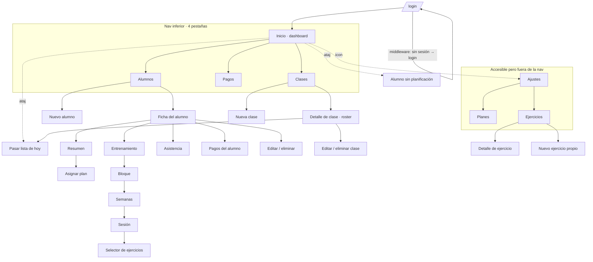

**24 rutas, 4 en la navegación.** `Planes` y `Ejercicios` cuelgan de Ajustes; `Ajustes` solo se alcanza por un icono en el dashboard (no está en la nav inferior). Todo lo que no es `/login` pasa por el middleware, que refresca sesión y redirige.

| Módulo | Estado | Nota |
|---|---|---|
| Login / sesión | 🟢 Funcional | Sin recuperación de contraseña |
| Dashboard | 🟢 Funcional | Un contador duplicado, un dato sin destino |
| Alumnos | 🟠 Incompleto | Sin foto de perfil (acción construida, sin UI) |
| Planificación | 🟢 Funcional | Profundo: 6 niveles hasta editar una serie |
| Clases y asistencia | 🟢 Funcional | Lo mejor resuelto de la app |
| Pagos | 🟠 Incompleto | Todo manual, sin vínculo con membresías |
| Planes / membresías | 🟠 Incompleto | Asignación no transaccional |
| Ejercicios | 🟠 Incompleto | 100 de 361 visibles, búsqueda sin acentos |
| Ajustes / perfil | 🟢 Funcional | — |
| Registro de entrenamiento | 🔴 Inexistente | Tabla + RLS sin una sola línea de app |

---

## Flujos principales

### 1. Pasar lista — el caso de uso crítico

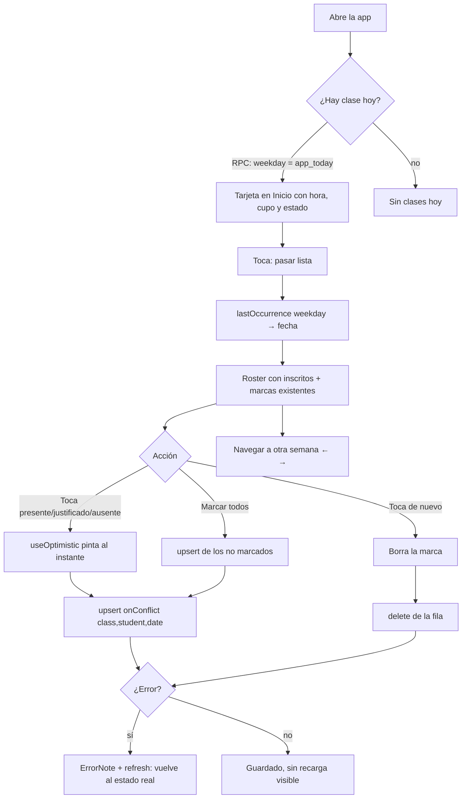

**Veredicto 🟢.** Dos toques desde abrir la app hasta marcar al primer alumno. Optimista, reversible, idempotente por clave única, con retroceso semanal. Es el flujo mejor diseñado del producto.

### 2. Armar una planificación

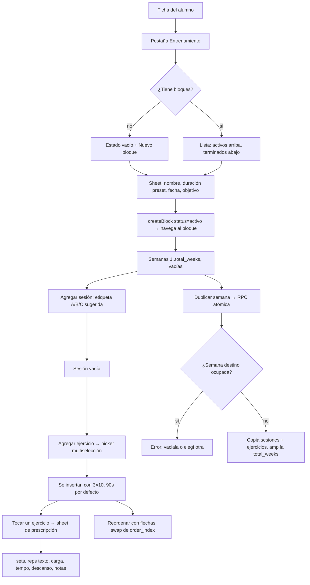

**Veredicto 🟡.** La mecánica es correcta y `duplicate_week` es la pieza que salva el flujo. Pero llegar a editar una serie son **seis niveles de navegación** (Alumnos → ficha → entrenamiento → bloque → sesión → sheet) y **cada alumno se arma desde cero**: no hay plantillas ni copia entre alumnos, que es exactamente lo que una entrenadora con grupos chicos hace todo el tiempo (la misma rutina base para cinco personas, con ajustes).

### 3. Cobrar

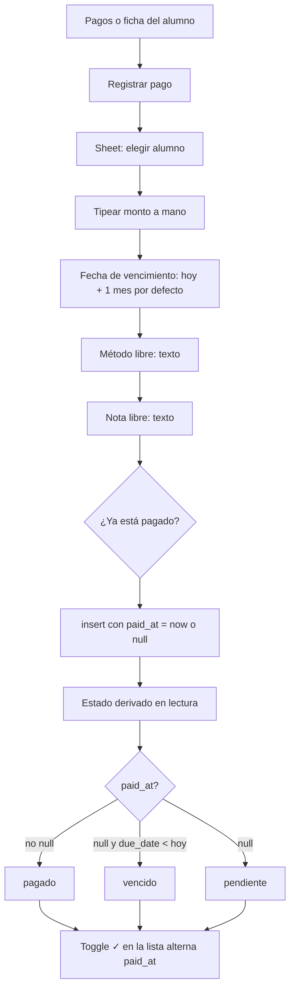

**Veredicto 🟠.** El modelo de datos es correcto — no guardar el estado es la decisión acertada. El flujo es el problema: **la membresía activa ya conoce el precio pactado y el ciclo, y nada de eso se usa.** Abril tipea el mismo importe, para el mismo alumno, el mismo día de cada mes, doce veces al año, por alumno. `membership_id` existe en el esquema, en el schema Zod y en la tabla — y el formulario lo manda siempre en `null`.

---

## Diagramas

### Máquina de estados: pago (derivado, no almacenado)

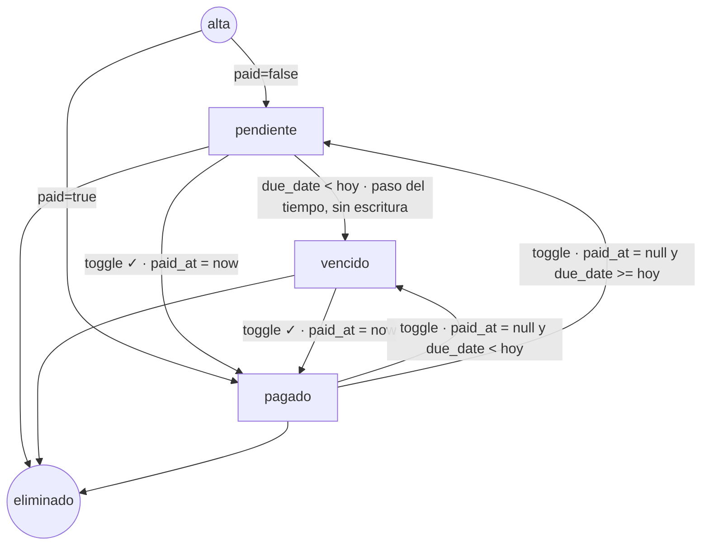

La transición `pendiente → vencido` no la dispara nadie: ocurre porque cambia el día. Es correcto y es la mejor decisión de modelado del proyecto.

### Máquina de estados: membresía

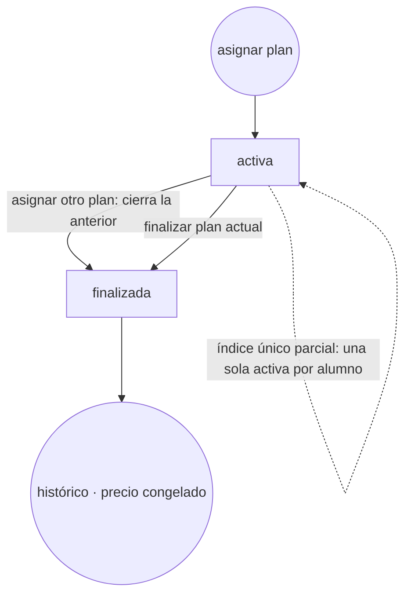

**Riesgo detectado:** el paso `activa → finalizada` y el alta de la nueva son **dos escrituras separadas sin transacción** (`src/lib/actions/plans.ts`). Si la segunda falla, el alumno queda sin plan y la UI dice "no se pudo asignar", sin indicar que además perdió el que tenía.

### Máquina de estados: bloque de entrenamiento

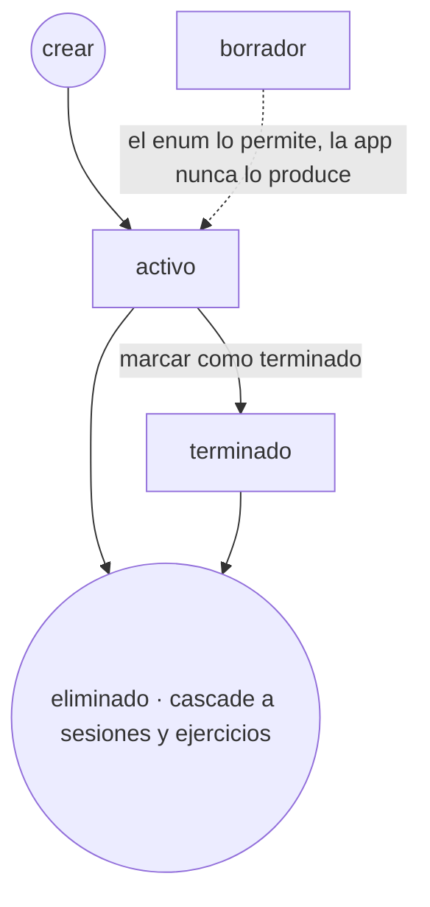

`borrador` existe en el enum y se muestra como badge, pero `createBlock` fuerza `status: 'activo'` y ninguna pantalla lo asigna: **estado muerto**.

### Máquina de estados: alumno

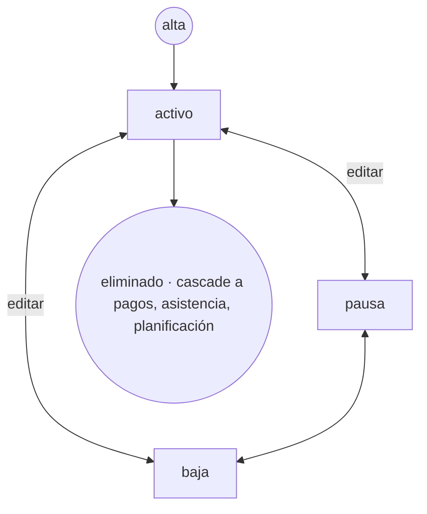

`pausa` y `baja` solo cambian un badge y el filtro de listado. **No cambian ningún comportamiento**: un alumno en baja sigue contando en pagos, sigue inscrito en clases, sigue apareciendo en el roster al pasar lista. La única diferencia real es que no aparece como candidato para inscribir en una clase nueva.

---

## Problemas encontrados

Clasificación: 🔴 crítico · 🟠 importante · 🟡 mejorable · 🟢 correcto.

### 🔴 Críticos

| # | Problema | Dónde | Consecuencia |
|---|---|---|---|
| C1 | La biblioteca de ejercicios muestra **100 de 361** sin paginación ni "cargar más" | `src/lib/queries/exercises.ts:14` (`limit ?? 100`) | Dos tercios del catálogo son inalcanzables salvo que se adivine el nombre. El selector dentro de una sesión es peor: `limit(60)` |
| C2 | Búsqueda **sensible a acentos** sobre un catálogo en español | `getExercises` (`ilike %q%`) y `ExercisePicker` | "triceps" no encuentra "Tríceps"; "biceps" no encuentra "Bíceps". Es el modo principal de acceso al catálogo |
| C3 | `assignPlan` **no es transaccional**: cierra la membresía anterior y después inserta la nueva | `src/lib/actions/plans.ts:75-95` | Si el insert falla (red, RLS, constraint), el alumno se queda sin plan y el mensaje no lo dice |

### 🟠 Importantes

| # | Problema | Dónde | Consecuencia |
|---|---|---|---|
| I1 | **Zona horaria incumplida en 9 lugares** pese a ser el principio más documentado | ver tabla dedicada abajo | Datos y etiquetas corridos un día entre las 21:00 y medianoche |
| I2 | Dos cálculos distintos de "cobrado del mes": TS con fecha del servidor vs SQL con `app_today()` | `queries/payments.ts:getPaymentTotals` vs `0012_timezone.sql` | El dashboard y `/pagos` pueden mostrar importes distintos en el cambio de mes |
| I3 | `/pagos` trae **200 pagos y filtra en el cliente** | `queries/payments.ts:30` | Con >200 pagos, el chip "vencido" muestra un subconjunto silencioso; los totales (calculados aparte, sin límite) no cuadran con la lista |
| I4 | **No hay forma de subir la foto de un alumno**; la acción existe y no se llama desde ninguna parte | `actions/students.ts:uploadStudentPhoto` | Todos los avatares son iniciales. Storage, políticas y URLs firmadas mantenidas sin uso |
| I5 | `abril_trainer_workout_logs`: tabla, índices y 5 políticas RLS **sin una sola query ni pantalla** | `0005_planning.sql`, `0008_rls_policies.sql` | Superficie de mantenimiento y de seguridad sin contraparte funcional |
| I6 | La política RLS `alumno lee su ficha` **expone `notes`**, que el propio proyecto declara privado de la entrenadora | `0008_rls_policies.sql:58` | Regla de negocio documentada incumplida a nivel de datos. Hoy latente (no hay acceso de alumno), activa el día que se abra |
| I7 | La fecha de asistencia **no se valida contra el día de la clase** | `clases/[classId]/asistencia/page.tsx` (solo regex) | `?fecha=2027-01-01` permite registrar asistencia de un martes en una clase de los jueves, o en el futuro |
| I8 | `getStudent` se ejecuta **dos veces por render** en las 4 pantallas de la ficha | `alumnos/[id]/*` + `StudentHeader`, sin `cache()` de React | Consulta duplicada en cada carga; el patrón se repetirá en cada pantalla nueva |
| I9 | El dashboard **recalcula "sin rutina" dos veces**: en la RPC y otra vez en TS con dos escaneos de tabla | `queries/dashboard.ts:getStudentsWithoutPlan` | Duplica la fuente de verdad de una regla de negocio, justo lo que el proyecto prohíbe |
| I10 | Cobrar es **100% manual** y no toca la membresía; `membership_id` siempre `null` | `pagos/payment-sheet.tsx:64` | Ver "Funcionalidades faltantes". Es la mayor carga repetitiva del producto |

### 🟡 Mejorables

| # | Problema | Dónde |
|---|---|---|
| M1 | `maximumScale: 1` en el viewport **bloquea el zoom** | `app/layout.tsx` — barrera de accesibilidad real, y el motivo original (zoom de iOS al enfocar inputs) ya está resuelto con `font-size: 16px` |
| M2 | Redirección abierta vía `?next=` en el login | `login-form.tsx`: `router.replace(params.get('next') \|\| '/')` acepta URLs absolutas |
| M3 | `asistencia_tomada` es `exists(...)`: **una sola marca** de seis pinta "Lista tomada" | `0012_timezone.sql` (RPC) |
| M4 | El cupo se valida solo al inscribir; **bajar la capacidad** deja clases sobrepobladas sin aviso | trigger `check_class_capacity` (solo `before insert`) |
| M5 | `borrador` (bloques) es un estado inalcanzable | enum en `0001_types.sql` vs `createBlock` |
| M6 | `pausa`/`baja` no cambian ningún comportamiento salvo un filtro | transversal |
| M7 | El roster y el selector de alumnos **no tienen buscador**: lista plana en un sheet | `clases/[classId]/roster.tsx`, `payment-sheet.tsx` (un `<select>` nativo con todos los alumnos) |
| M8 | El picker de ejercicios **no muestra la media**, solo nombre y músculo | `exercise-picker.tsx` — 361 ejercicios con vídeo, elegidos a ciegas |
| M9 | El picker consulta Supabase **desde el navegador**, única excepción a "el servidor lee" | por eso la ruta de sesión pesa 190 kB de JS frente a ~110 kB del resto |
| M10 | `por_vencer` en el dashboard **no es clicable**: informa y no lleva a ninguna parte | `app/(app)/page.tsx` |
| M11 | "Alumno eliminado" en la lista de pagos es **código inalcanzable** (el FK es `on delete cascade`) | `payments-list.tsx:80` |
| M12 | Sin recuperación de contraseña ni segunda vía de acceso | producto de una sola cuenta: el olvido implica entrar al panel de Supabase |
| M13 | Sin service worker: se instala como PWA pero **no funciona sin conexión** en absoluto | `public/manifest.json`, sin `sw.js` |
| M14 | El saludo del dashboard usa la hora del servidor (UTC) | `app/(app)/page.tsx:Greeting` |
| M15 | Media de ejercicios propios en bucket **público**; el path es adivinable si se conocen los ids | `0010_storage.sql` |
| M16 | Sin límite de tamaño para listas largas: `getStudents` sin paginación, asistencia limitada a 40 filas sin "ver más" | `queries/students.ts`, `queries/classes.ts` |

### 🟢 Correcto — verificado, no tocar

- RLS activa en las 14 tablas, con funciones auxiliares `security definer` para evitar recursión, y `security_invoker = true` en la vista de pagos. Cero `.eq('trainer_id')` en el código de la app: **la regla se cumple sin excepción**.
- `GRANT` explícitos + `alter default privileges` + `revoke` a `anon`: postura más cerrada que la de Supabase por defecto.
- `getUser()` y nunca `getSession()` en el servidor. `requireUser()` para lecturas, `currentUserId()` para acciones — la distinción está bien fundada y bien aplicada.
- `duplicate_week` como RPC `security invoker`, atómica, con validación de semana ocupada.
- Estado de pago derivado, sin columna ni cron.
- El patrón `ActionResult` / `ok` / `fail` aplicado sin excepciones; ningún mensaje crudo de Postgres llega a la UI.
- Validación Zod compartida formulario ↔ acción, con el servidor revalidando siempre.
- `npm run check` y `npm run build` pasan limpios; 24 rutas compiladas, sin warnings de tipo ni de lint.
- Estados vacíos específicos por lista, con acción sugerida. `loading.tsx` por segmento. `error.tsx` con copy orientado al caso real ("si el gimnasio tiene mal wifi, probá con datos").
- Escapado de comas y paréntesis antes del filtro `or` de PostgREST — detalle que casi nadie contempla.

### Detalle: las 9 infracciones de zona horaria

Existe `todayISO()` en el cliente y `abril_trainer_app_today()` en SQL. Estos puntos no los usan:

| Archivo | Línea aprox. | Qué rompe |
|---|---|---|
| `app/(app)/clases/page.tsx` | `new Date().getDay()` | El badge "Hoy" se corre de día a partir de las 21:00 ART |
| `app/(app)/page.tsx` | `new Date().getHours()` | Saludo por hora UTC |
| `lib/queries/payments.ts` | `getPaymentTotals` | "Cobrado este mes" en la zona del servidor; discrepa con el dashboard |
| `lib/queries/students.ts` | ventana de 30 días de asistencia | `toISOString()` = UTC |
| `lib/format.ts` | `daysUntil` / `dueLabel` | "vence hoy" mal de noche |
| `app/(app)/pagos/payment-sheet.tsx` | `defaultDueDate` | Vencimiento por defecto un día adelantado de noche |
| `app/(app)/alumnos/[id]/plan/assign-plan-form.tsx` | `starts_on` | Membresía que empieza mañana |
| `app/(app)/alumnos/[id]/entrenamiento/new-block-button.tsx` | `starts_on` por defecto | Bloque que empieza mañana |
| `lib/actions/plans.ts` | `ends_on` en `assignPlan` y `endMembership` | Cierre de membresía con fecha UTC |

Ninguna es catastrófica por separado. Juntas convierten un principio declarado en una regla que se cumple a veces, que es peor que no tenerla: nadie sabe de qué lado está cada fecha.

---

## UX / UI

**Lo que funciona.** El sistema visual es sobrio y coherente; el acento lima usado con disciplina hace que en cada pantalla se vea cuál es la acción principal. Los objetivos táctiles se respetan de verdad (44px verificado en `Button`, `IconButton`, botones de asistencia y chips). Los estados vacíos dicen qué hacer, no "no hay datos". `Sheet` está construido sobre `<dialog>` nativo: foco atrapado, Escape y fondo inerte gratis, sin dependencias.

**Lo que no.**

- **Ajustes no está en la navegación.** Se llega por un engranaje en la esquina del dashboard. Y detrás de Ajustes están Planes y Ejercicios, que no son configuración: son catálogos de trabajo diario. Un tercio del producto vive a dos toques escondidos.
- **Profundidad de la planificación.** Seis niveles hasta ajustar una serie. La regla interna ("editar un ejercicio no cambia de pantalla") se cumple, pero llegar hasta ahí no.
- **Dos patrones para la misma tarea.** Asignar plan es una pantalla completa con navegación; registrar un pago es un sheet. Editar un plan es un sheet; editar un alumno es una pantalla. No hay criterio visible.
- **Elegir ejercicios a ciegas.** El picker muestra nombre y músculo en texto. La app tiene 361 vídeos y no los usa justo donde más ayudarían a decidir.
- **Listas sin buscador donde importa.** Inscribir en clase = lista plana. Elegir alumno para un pago = `<select>` nativo. Con 30-40 alumnos, ambas son scroll ciego.
- **Sin búsqueda global.** Encontrar a un alumno desde el dashboard exige ir a la pestaña Alumnos y escribir. Es la acción más frecuente del producto.
- **Zoom bloqueado** (`maximumScale: 1`). Innecesario y excluyente.
- **`hover` como única señal en varias filas** (`hover:bg-surface-2`). No es un fallo funcional — las filas son enlaces — pero contradice la regla escrita en el README.

---

## Lógica de negocio

**Sólida:** el estado de pago derivado; el precio congelado en la membresía; el cupo en trigger y no solo en el formulario; no materializar ocurrencias de clase; `reps`/`load` como texto; `on delete restrict` en planes y ejercicios en uso, con mensaje que propone la alternativa correcta ("desactivalo en vez de borrarlo").

**Floja:**

1. **La membresía no gobierna nada.** Debería ser el contrato del que salen los cobros; hoy es una etiqueta decorativa en la ficha. Precio, frecuencia y duración están cargados y no se usan para nada más que mostrarse.
2. **`sessions_per_week` del plan no se cruza con la planificación ni con la asistencia.** Se le vende a un alumno "3 veces por semana", se le arman 2 sesiones y se le registran 4 asistencias, y el sistema no dice nada. Es el dato que hace posible el único control de negocio que le falta al producto.
3. **`pausa` y `baja` no hacen nada.** Un alumno de baja sigue apareciendo al pasar lista y sumando a los pendientes.
4. **Eliminar un alumno borra su historial de pagos** (`on delete cascade`). El diálogo lo advierte, pero contablemente lo correcto es que un cobro sobreviva a la baja de quien lo hizo. Compárese con el cuidado puesto en `on delete restrict` para no romper el histórico al borrar un plan: la misma preocupación, resuelta al revés.
5. **`duplicate_week` solo agrega al final.** Duplicar la semana 1 sobre una semana 3 ya cargada exige vaciarla antes a mano, sesión por sesión.

---

## Performance

Escala real: una entrenadora, ~30 alumnos, ~200 pagos al año. **Nada de lo que sigue duele hoy**; lo que sigue es lo que se degrada primero y lo que ya se paga sin motivo.

- **190 kB de JS en la ruta de sesión** frente a ~110 kB del resto, porque `ExercisePicker` embarca `supabase-js` en el cliente. Es la pantalla que más se usa armando planificación y la única que rompe el patrón "el servidor lee".
- **Consultas duplicadas por render:** `getStudent` dos veces en las 4 pantallas de ficha (falta `cache()` de React, que existe justo para esto). `getStudentsWithoutPlan` hace dos escaneos de tabla para recalcular un número que la RPC ya trajo.
- **`/pagos` hace tres viajes** (200 pagos + totales sobre la tabla completa + todos los alumnos activos para el `<select>`) y filtra en memoria.
- **Sin paginación en ningún listado.** Ejercicios corta en 100 sin avisar; alumnos, pagos y asistencia tienen techos fijos.
- **Sin caché de datos.** Todo es dinámico y se revalida por ruta; con `revalidatePath` bien puesto, algunas lecturas (catálogo de ejercicios, planes) admitirían caché sin riesgo de datos viejos.
- **Bien resuelto:** URLs firmadas en lote (`createSignedUrls`) en vez de N peticiones; agregados del dashboard en una sola RPC; `Suspense` separando el conteo de la biblioteca del buscador para que el filtro no espere al `count`.

---

## Mobile

Es lo mejor cuidado del proyecto y se nota que las reglas se escribieron desde el uso real:

- 44px verificado en todos los controles interactivos; inputs a 16px; `inputMode` correcto por campo; una columna por formulario; reordenar con flechas; `safe-bottom` en el pie de los sheets; `overscroll-contain` en el scroll interno; alta de alumno en dos pasos guardable en el primero.
- El script antiparpadeo del tema corre antes del primer pintado.

**Pendientes reales en móvil:**

| Problema | Impacto |
|---|---|
| Zoom bloqueado (`maximumScale: 1`) | Accesibilidad; además ya no hace falta |
| Sin funcionamiento offline | El `error.tsx` reconoce el mal wifi del gimnasio y no ofrece más que "Reintentar". Pasar lista es justo lo que se hace ahí |
| La navegación por semanas apila entradas en el historial (`router.push`) | Volver atrás obliga a deshacer semana por semana; debería ser `replace` |
| Buscar en la biblioteca escribe en la URL con debounce y re-renderiza en servidor | Con 4G lento, cada pausa al tipear es un viaje completo |

---

## Seguridad

**Bien, y por las razones correctas.** RLS en las 14 tablas como única autorización; `GRANT` separados de RLS y ambos presentes; `anon` sin acceso a nada; vista con `security_invoker`; funciones auxiliares `security definer` acotadas a resolver pertenencia; `duplicate_week` deliberadamente `invoker`; `getUser()` en servidor; `service_role` solo en scripts locales; mensaje de login genérico a propósito para no distinguir "email inexistente" de "contraseña incorrecta".

**Hallazgos:**

| Severidad | Hallazgo | Detalle |
|---|---|---|
| 🟠 | `notes` del alumno legible por el propio alumno | La política `alumno lee su ficha` es `using (user_id = auth.uid())` sobre la fila completa. El proyecto declara que `notes` no debe exponerse nunca. Latente hoy, activo el día que se implemente el acceso del alumno — que es justamente el escenario para el que la política existe |
| 🟡 | Redirección abierta en el login | `?next=https://…` se pasa a `router.replace` sin validar que sea una ruta relativa. Vector de phishing sobre la única cuenta del sistema |
| 🟡 | Bucket de media público | La media de ejercicios propios queda en `{trainer_id}/{exercise_id}.ext` legible por cualquiera que conozca la ruta. Correcto para el catálogo, discutible para lo que sube la entrenadora |
| 🟡 | Sin recuperación de contraseña | Con una sola cuenta, el olvido significa entrar al panel de Supabase. No es una vulnerabilidad, es un riesgo operativo |
| 🟢 | Server Actions confían en RLS para autorizar por id | Correcto y verificado: `updateStudent(id)`, `deletePayment(id)` etc. reciben ids arbitrarios y la política los rechaza. Es el diseño, no un descuido |
| 🟢 | Sin secretos en el código | `.env.example` solo con nombres; `service_role` únicamente en `scripts/` |

---

## Datos / Arquitectura

**El esquema es la mejor parte del proyecto.** 14 tablas, nombres consistentes con prefijo, comentarios en las columnas que explican decisiones (no repiten el nombre), índices parciales donde corresponde (`where active`, `where paid_at is null`), único parcial para "una membresía activa", enums en vez de texto libre, y reglas de negocio en la base cuando tienen que estarlo.

**Deuda concreta:**

1. **`abril_trainer_workout_logs` es una tabla fantasma.** Con RLS, índices y políticas para dos roles. O se usa, o se saca del esquema hasta que se use.
2. **`abril_trainer_students.user_id` y `profiles.role` preparan un acceso de alumno inexistente.** Defendible como decisión de migración futura, pero hoy son superficie de política RLS que nadie ejercita (y donde ya se coló el problema de `notes`).
3. **`membership_id` en pagos: columna presente, siempre nula.** Es el vínculo que haría automatizable el cobro.
4. **`total_weeks` es redundante con las sesiones reales** y `duplicate_week` lo corrige con `greatest(...)`. Dos fuentes para "cuántas semanas tiene el bloque".
5. **Sin `cache()` de React en las lecturas.** La consecuencia (I8) ya está; el patrón se replicará en cada pantalla nueva.
6. **El único test es SQL.** Correcto priorizar RLS, pero `payment-status.ts` duplica a propósito una regla de la vista SQL y **nada verifica que las dos sigan coincidiendo**. Es el punto exacto donde el proyecto se autoriza a duplicar lógica, y es el que no tiene red.
7. **Sin CI.** `npm run check` pasa, pero solo si alguien se acuerda de correrlo.

---

## Funcionalidades que eliminaría

Cada una con su motivo; nada de esto es "sobra por las dudas".

| Qué | Por qué | Alternativa |
|---|---|---|
| **`abril_trainer_workout_logs`** (tabla, índices, 5 políticas) | Cero código de app en cualquier dirección. Mantiene superficie RLS que nadie prueba | Migración que la elimine, o construir el registro de entrenamiento. Lo que no puede es quedarse a medio camino |
| **Estado `borrador` de bloque** | Inalcanzable: `createBlock` siempre fuerza `activo` | Sacar del enum |
| **Rama "Alumno eliminado"** en la lista de pagos | Código muerto: el FK es `cascade`, no puede haber pago huérfano | Borrarla — o, mejor, cambiar el FK y hacerla real (ver "faltantes") |
| **`method` como texto libre** en pagos | Cinco escrituras distintas de "transferencia" hacen imposible cualquier corte por método | Enum corto: efectivo · transferencia · otro |
| **`duration_weeks` en planes** | Se carga y no se usa en ningún cálculo, ni siquiera para vencimientos | Eliminar, o usarlo para el vencimiento de la membresía |
| **Filtro "Propios"** en la biblioteca | Con 361 del catálogo y unos pocos propios, "Favoritos" ya cubre el acceso rápido | Un chip menos en una fila que ya hace scroll horizontal |
| **`app/(app)/alumnos/[id]/plan` como pantalla completa** | Es elegir de una lista y confirmar un precio: cabe en un sheet como el de planes | Unificar en sheet, ahorra una navegación |

**Lo que NO eliminaría, aunque parezca candidato:** las cuatro pestañas de la ficha del alumno (cada una tiene contenido propio), el paso 2 del alta (es opcional y guardable), los favoritos de ejercicios (gesto de alta frecuencia bien resuelto) y `duplicate_week` (es la funcionalidad de mayor retorno del producto).

---

## Funcionalidades que simplificaría

1. **Un solo patrón para editar.** Sheet para todo lo que es "un objeto, pocos campos" (plan, pago, membresía, sesión); pantalla completa solo para lo que tiene subestructura (alumno, bloque). Hoy es azaroso.
2. **Planes y Ejercicios fuera de Ajustes.** Son catálogos de trabajo, no configuración. Van accesibles desde donde se usan: "Ejercicios" desde la sesión (ya lo está, vía picker) y desde Alumnos; "Planes" desde la ficha del alumno al asignar. Ajustes se queda con perfil, tema y salir.
3. **Nuevo bloque → semana 1 ya creada** con tantas sesiones como `sessions_per_week` del plan activo. Hoy: crear bloque, ver semanas vacías, crear sesión, elegir etiqueta. Tres toques que el sistema ya puede inferir.
4. **Registrar pago con todo precargado** desde la membresía activa: alumno, importe y vencimiento. Queda un toque: confirmar.
5. **Reemplazar `duplicate_week` "solo al final"** por "duplicar en la semana N", con confirmación si está ocupada. La RPC ya acepta `p_to_week`; la UI no lo expone.
6. **Buscador dentro de los selectores de alumno** (roster y pago). Un `<input>` filtrando en memoria: la lista ya está cargada.
7. **Thumbnails en el picker de ejercicios.** La media ya es pública y cacheada por CDN.

---

## Funcionalidades faltantes

Solo las que resuelven un problema observable en el código o en el flujo, no ideas sueltas.

| Falta | Problema que resuelve | Esfuerzo |
|---|---|---|
| **Generar los cobros del mes desde las membresías activas** | Hoy son N formularios manuales idénticos cada mes. Una pantalla "Cobros de septiembre" que proponga una fila por membresía activa (con su precio congelado y su vencimiento) y se confirme de una vez | Medio |
| **Vincular pago ↔ membresía** (`membership_id`) | La columna existe y va siempre en `null`. Sin esto no hay "cuántos meses lleva pagos este alumno" ni ingresos por plan | Bajo |
| **Plantillas de rutina / copiar bloque entre alumnos** | Cada alumno se arma desde cero. Es la carga de trabajo más repetitiva después de los cobros. La RPC de duplicar semana ya demuestra que el patrón es viable | Medio |
| **Subir la foto del alumno** | La acción existe, el bucket existe, las políticas existen, la UI no. Reconocer a alguien por su cara al pasar lista, en una lista de 6, importa | Bajo |
| **Cancelar o mover una clase puntual** (`class_exceptions`) | Feriados y lluvia existen. Hoy la única salida es marcar a todos como justificados. El repo ya lo tiene identificado; con el "pasar lista" a fecha libre sin validar, además, es la mitad del trabajo hecho | Medio |
| **Registro de lo realmente entrenado** | La tabla está, con RLS. Sin esto, "prescripción vs. ejecución" — el eje declarado del modelo — es solo la mitad | Alto |
| **Recuperación de contraseña** | Una cuenta, un olvido, un panel de Supabase | Bajo |
| **Adherencia: sesiones planificadas vs. asistencias reales** | `sessions_per_week` está cargado y no se cruza con nada. Es el único indicador que la entrenadora no puede sacar hoy y que la app ya tiene los datos para dar | Medio |
| **Service worker mínimo** | "Se instala como PWA" es cierto; "funciona con mal wifi" no. Cachear el shell y encolar las marcas de asistencia cubriría el caso real | Medio |
| **CI que corra `npm run check` y `db:test`** | Las verificaciones existen y dependen de la memoria de quien commitea | Bajo |

**Lo que sigue estando bien afuera:** Mercado Pago, facturación, IA, portal del alumno, chat, informes, multi-gimnasio. La lista de "fuera del MVP" del README está bien pensada y no hay que tocarla.

---

## Flujo ideal

### Cobrar — de 8 pasos a 2

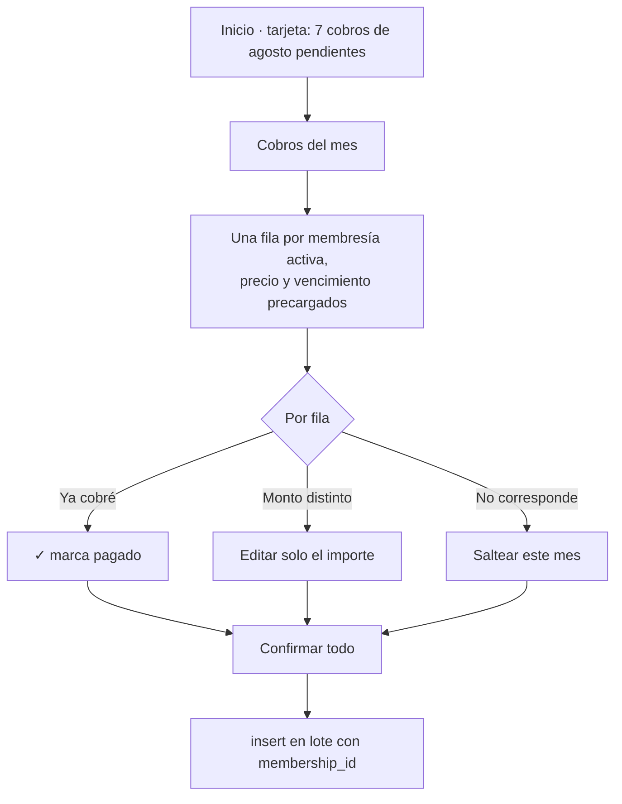

Lo que desaparece: elegir alumno, tipear importe, elegir vencimiento, repetirlo N veces. Lo que la app ya sabe: quién tiene membresía activa, cuánto paga y desde cuándo.

### Armar una planificación — de 6 niveles a 3

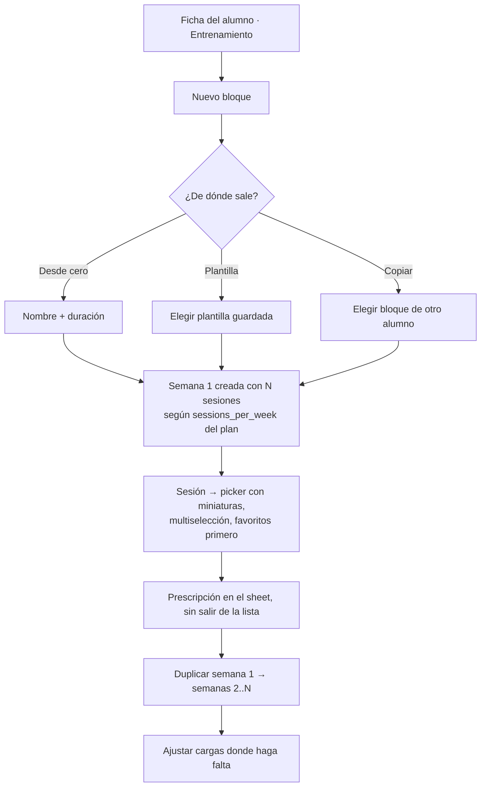

### Pasar lista — ya es óptimo, con dos añadidos

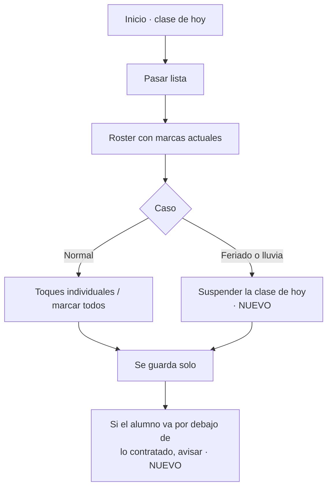

---

## Antes vs. Después

| Flujo | Actual | Propuesto | Se gana |
|---|---|---|---|
| Cobrar el mes (10 alumnos) | 10 × 6 campos = ~60 interacciones | Revisar lista + confirmar ≈ 12 | ~80% menos carga manual |
| Armar bloque de 4 semanas | Crear bloque → 4 semanas vacías → crear sesión (×N) → elegir ejercicios sin ver → prescribir → duplicar | Plantilla o copia → semana 1 lista → prescribir → duplicar | 3 niveles menos, elección con imagen |
| Encontrar un ejercicio | Escribir sin acentos falla; solo 100 de 361 alcanzables | Búsqueda `unaccent` + paginación o scroll infinito | Catálogo completo, de verdad |
| Pasar lista | 2 toques desde el inicio ✅ | Igual + suspender clase | Cubre feriados sin falsear datos |
| Asignar plan | Pantalla completa + navegación + volver | Sheet sobre la ficha | 2 navegaciones menos |
| Llegar a Planes / Ejercicios | Inicio → engranaje → Ajustes → ítem | Desde donde se usan | 2 toques menos, jerarquía honesta |
| Fecha "hoy" | 9 lugares con la zona del servidor | `todayISO()` / `app_today()` en todos | Un solo "hoy" en todo el sistema |

---

## Roadmap

**Fase 0 — Corregir lo que ya está roto (1 sprint).** C1, C2, C3, I1, I2, I3, I6, I7. Nada nuevo: la biblioteca completa y buscable, un solo "hoy", la asignación de plan atómica, la fecha de asistencia validada y `notes` fuera del alcance del alumno.

**Fase 1 — Cerrar lo que quedó a medias (1 sprint).** Subir foto (I4), decidir qué pasa con `workout_logs` (I5: usar o eliminar), `cache()` en las lecturas (I8), desduplicar el dashboard (I9), sacar el código y los estados muertos, CI con `check` + `db:test`.

**Fase 2 — Automatizar el cobro (1–2 sprints).** Vincular `membership_id`, generar los cobros del mes desde las membresías activas, enum de método, tarjeta de cobros pendientes en el inicio. **Es la fase de mayor retorno del roadmap.**

**Fase 3 — Acelerar la planificación (1–2 sprints).** Plantillas y copia entre alumnos, semana 1 precreada, miniaturas y buscador en el picker, `duplicate_week` a una semana concreta, picker en el servidor para bajar los 190 kB.

**Fase 4 — Cubrir la realidad operativa (2 sprints).** `class_exceptions` (suspender/mover), adherencia contra `sessions_per_week`, service worker con cola de asistencia offline, recuperación de contraseña.

**Fase 5 — Lo que hoy no toca.** Registro de entrenamiento ejecutado y portal del alumno: los dos requieren decidir primero si el producto quiere ese alcance. El esquema los espera; el roadmap no debería asumirlos.

---

## Priorización

| Prioridad | Problema | Impacto | Solución |
|---|---|---|---|
| **P0** | Biblioteca limitada a 100 de 361 ejercicios, sin paginar | Alto | Scroll infinito o "cargar más" en `getExercises` y en el picker |
| **P0** | Búsqueda sensible a acentos en catálogo español | Alto | `unaccent` en Postgres + índice trigram, o columna normalizada |
| **P0** | `assignPlan` no transaccional: puede dejar al alumno sin plan | Alto | RPC `security invoker` que cierre e inserte en una transacción |
| **P0** | 9 puntos con la zona horaria del servidor | Alto | `todayISO()` en cliente/servidor y `app_today()` en SQL, sin excepciones |
| **P0** | `notes` expuesto al alumno por RLS | Alto | Política de columnas o vista sin `notes` para el rol alumno |
| **P1** | "Cobrado del mes" calculado de dos formas distintas | Alto | Una sola fuente: leer el agregado de la RPC también en `/pagos` |
| **P1** | `/pagos` filtra 200 filas en cliente; totales sin límite | Alto | Filtrar en la query, paginar, totales por agregado SQL |
| **P1** | Cobro 100% manual, `membership_id` siempre nulo | Alto | Fase 2: generación mensual desde membresías activas |
| **P1** | Fecha de asistencia sin validar contra el día de la clase | Alto | Validar `weekdayOf(fecha) == klass.weekday` y rechazar futuro |
| **P1** | Sin forma de subir la foto del alumno | Medio | Conectar `uploadStudentPhoto` en la edición del alumno |
| **P1** | `getStudent` duplicado en las 4 pantallas de ficha | Medio | `cache()` de React en las queries de lectura |
| **P1** | `workout_logs` fantasma con RLS activa | Medio | Migración que la elimine, o construir la funcionalidad |
| **P1** | Sin CI | Medio | Action con `npm run check` + `db:test` |
| **P2** | Zoom bloqueado (`maximumScale: 1`) | Medio | Quitarlo: los 16px ya resuelven el zoom de iOS |
| **P2** | Redirección abierta vía `?next=` | Medio | Aceptar solo rutas que empiecen con `/` |
| **P2** | Sin plantillas ni copia de rutinas entre alumnos | Medio | Fase 3 |
| **P2** | Picker de ejercicios sin imagen, con `supabase-js` en el cliente | Medio | Server Action de búsqueda + miniaturas desde el CDN |
| **P2** | Planes y Ejercicios escondidos bajo Ajustes | Medio | Reubicar donde se usan |
| **P2** | Selectores de alumno sin buscador | Medio | `<input>` filtrando en memoria |
| **P2** | `asistencia_tomada` con una sola marca | Bajo | Comparar contra el total de inscritos |
| **P2** | Sin recuperación de contraseña | Bajo | `resetPasswordForEmail` de Supabase |
| **P2** | Reducir la capacidad no valida inscripciones existentes | Bajo | Trigger `before update` en `classes` o aviso en el formulario |
| **P3** | Sin `class_exceptions` (suspender/mover clase) | Medio | Fase 4 |
| **P3** | Sin service worker / offline | Medio | Cachear shell + cola de asistencia |
| **P3** | Sin adherencia (planificado vs. asistido) | Medio | Cruce con `sessions_per_week` |
| **P3** | `pausa`/`baja` sin efecto de negocio | Bajo | Excluir de cobros y rosters, o simplificar a activo/inactivo |
| **P3** | Eliminar alumno borra su historial de pagos | Bajo | `on delete set null` + `deleted_at`, si se quiere conservar el histórico |
| **P3** | Estados y código muertos (`borrador`, "Alumno eliminado", `duration_weeks`, `method` libre) | Bajo | Limpieza |
| **P3** | Sin test que verifique que `payment-status.ts` y la vista SQL coinciden | Bajo | Aserción en `rls_test.sql` comparando ambas |

---

## Score general

| Dimensión | Nota | Comentario |
|---|---|---|
| Arquitectura | 9/10 | Coherente, documentada, sin excepciones salvo el picker |
| Base de datos | 9/10 | Lo mejor del proyecto; le sobra una tabla fantasma |
| Seguridad | 8/10 | RLS ejemplar; `notes` y la redirección abierta bajan la nota |
| UX / UI | 7/10 | Sistema visual y reglas móviles muy por encima del promedio; jerarquía y profundidad, no |
| Lógica de negocio | 6/10 | Modelado excelente, explotación pobre: la membresía no gobierna nada |
| Completitud funcional | 5/10 | Tres funcionalidades construidas y desconectadas |
| Performance | 7/10 | Sobrada para la escala real; duplicaciones evitables y 190 kB en la ruta clave |
| Mobile | 8/10 | Reglas propias cumplidas; sin offline y con el zoom bloqueado |
| Calidad de código | 8/10 | Compila limpio, comentarios que explican el porqué; sin tests de la lógica TS |
| Consistencia (dicho vs. hecho) | 5/10 | El principio más repetido del proyecto está incumplido en 9 lugares |

### **Score global: 7,2 / 10**

---

## Veredicto

**Un MVP sólido al que le falta terminar, no rehacer.**

Este proyecto está en el percentil alto de lo que suele verse en una app de gestión de nicho: el modelo de datos está pensado por alguien que entendió el dominio, la RLS está bien hecha y bien probada, las decisiones difíciles (no guardar el estado del pago, no materializar las clases, texto en vez de número para las repeticiones) están tomadas con criterio y documentadas. No hay deuda arquitectónica. No hay nada que justifique reescribir un módulo.

Lo que hay es una brecha de terminación en tres frentes, y los tres son baratos comparados con lo que ya está construido: **funcionalidad conectada a medias** (foto del alumno, `workout_logs`, `membership_id`), **una regla propia que se cumple a medias** (la zona horaria, que es peor que no tenerla porque nadie sabe de qué lado está cada fecha), y **datos que se cargan y no se usan** (`sessions_per_week`, el precio de la membresía, `duration_weeks`).

La pregunta que ordena el roadmap no es qué agregar sino **por qué la membresía, que es el contrato comercial del negocio, no genera ni un solo cobro**. Resolver eso —Fase 2— convierte la app de "un cuaderno más ordenado" en "el sistema que le lleva la facturación". Todo lo demás es mantenimiento.

**Recomendación:** Fase 0 antes de poner esto en manos de nadie (son correcciones acotadas, ninguna estructural), Fase 2 como la primera inversión de producto real.
